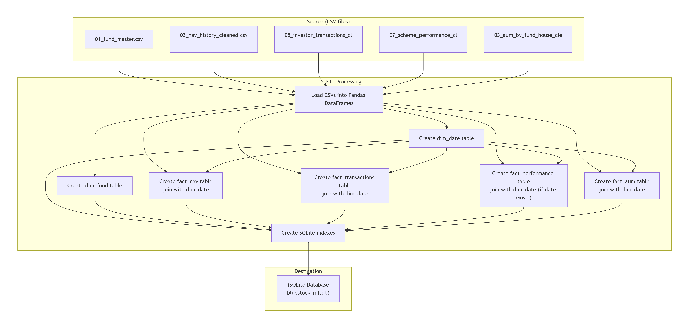
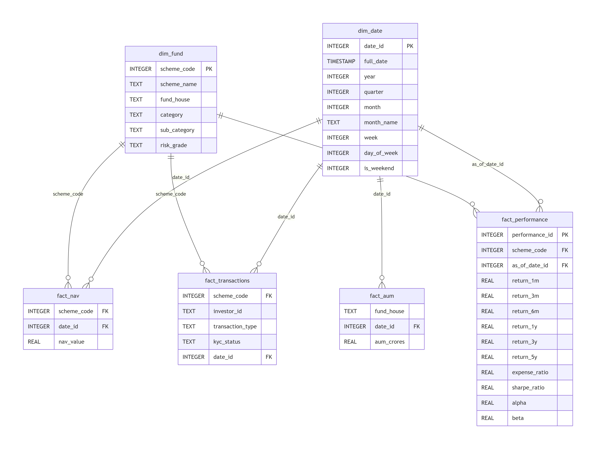
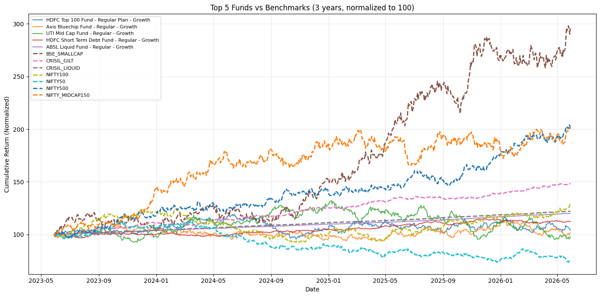
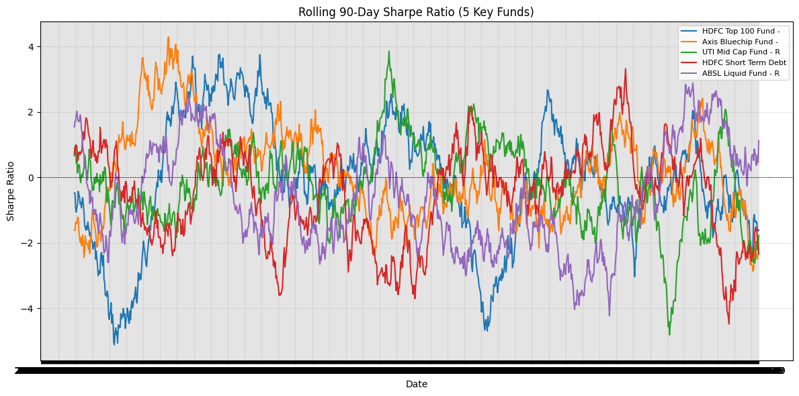
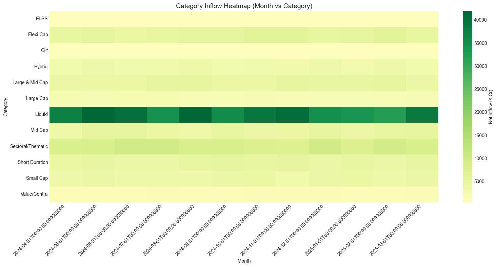
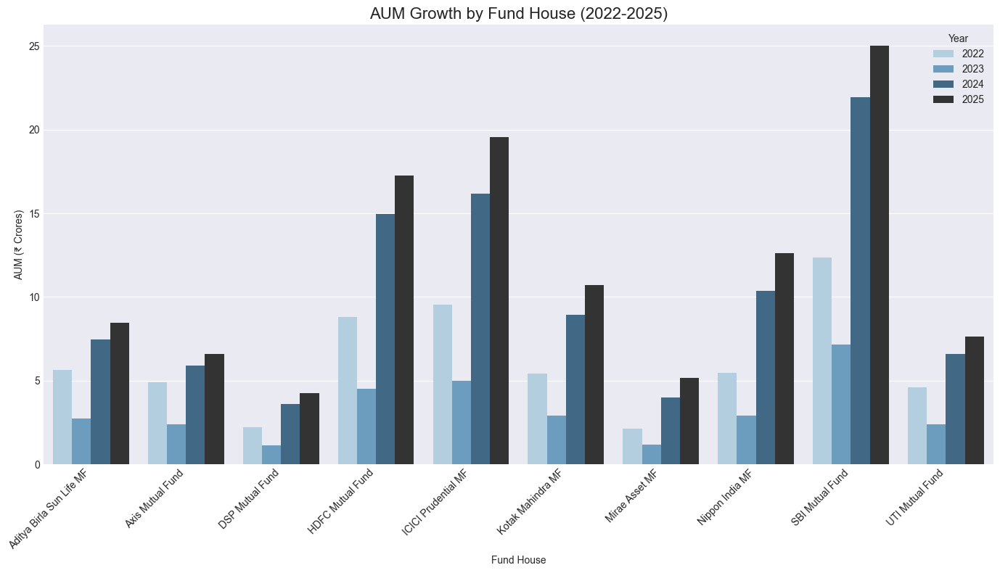

# 📊 Bluestock Mutual Fund Analytics & Portfolio Intelligence System

[](https://www.python.org/)
[](https://www.sqlite.org/)
[](https://streamlit.io/)
[](https://powerbi.microsoft.com/)
[](LICENSE)

An end-to-end data engineering, risk analytics, and quantitative portfolio intelligence platform built for Indian Mutual Funds (AMFI data). This project automates raw data ingestion, cleanses NAV and transactional records, builds a star-schema analytical database in SQLite/PostgreSQL, performs advanced risk-return metrics analysis, and delivers insights via a **Streamlit Web Application**, **Power BI Dashboard**, **Monte Carlo Simulation engine**, and an **Automated Email Reporting system**.

---

## 📌 Table of Contents

- [Project Overview](#-project-overview)
- [Key Features](#-key-features)
- [System Architecture](#-system-architecture)
- [Database Star Schema](#-database-star-schema)
- [Repository Structure](#-repository-structure)
- [Installation & Setup](#-installation--setup)
- [Usage Guide](#-usage-guide)
  - [1. Data Pipeline & ETL](#1-data-pipeline--etl)
  - [2. Streamlit Web App](#2-streamlit-web-app)
  - [3. Fund Recommender Engine](#3-fund-recommender-engine)
  - [4. Monte Carlo Simulation](#4-monte-carlo-simulation)
  - [5. Automated Email Reporter](#5-automated-email-reporter)
  - [6. Power BI Dashboard](#6-power-bi-dashboard)
- [Analytics & Visualizations](#-analytics--visualizations)
- [Tech Stack](#-tech-stack)
- [License & Acknowledgments](#-license--acknowledgments)

---

## 🎯 Project Overview

Mutual fund analytics require processing high-frequency Net Asset Value (NAV) updates, tracking AUM movements across Asset Management Companies (AMCs), evaluating portfolio risk-adjusted performance, and delivering actionable investment recommendations. 

This repository houses the complete **Bluestock Mutual Fund Analytics Capstone Solution**, which addresses these challenges through:
1. **Automated ETL & Data Warehousing**: Ingestion and transformation of raw AMFI datasets into a normalized Star Schema stored in SQLite (`bluestock_mf.db`).
2. **Quantitative Performance Analytics**: Computation of key performance metrics including CAGR, Sharpe Ratio, Sortino Ratio, Alpha, Beta, Maximum Drawdown, and Rolling Returns.
3. **Smart Recommender Engine**: Filter and score-based fund recommendations tailored to investor risk profiles and investment horizons.
4. **Interactive BI & Web Apps**: Dual reporting interfaces via Streamlit (`app.py`) and Power BI (`bluestock_mf.pbix`).
5. **Advanced Forecasting & Stress Testing**: Monte Carlo NAV simulations for future portfolio value distributions and Value-at-Risk (VaR) estimation.
6. **Automated Workflow**: Scheduled weekly PDF/HTML summary digest dispatch via email.

---

## ✨ Key Features

- 🔄 **Automated Data Pipeline (`scripts/etl_pipeline.py`)**: Seamless parsing, date dimensionalization, transaction cleaning, and relational loading into SQLite.
- ⚡ **Live NAV Fetcher (`scripts/live_nav_fetch.py`)**: Real-time NAV data polling from financial endpoints/APIs for live portfolio tracking.
- 🎯 **Mutual Fund Recommender (`scripts/recommender.py`)**: Multi-criteria recommendation system based on risk-adjusted scores and user preferences.
- 🖥️ **Streamlit Analytics Dashboard (`Bonus Tasks/B2 - Streamli app/app.py`)**: Interactive web interface featuring NAV trend visualizers, fund comparisons, risk vs. return scatter plots, and portfolio tracking.
- 📊 **Power BI Dashboard (`dashboard/bluestock_mf.pbix`)**: Executive dashboard offering deep insights into AUM growth, sector allocation, fund house performance, and investor flows.
- 🎲 **Monte Carlo Simulations (`Bonus Tasks/B3 — Monte Carlo simulation`)**: Geometric Brownian Motion (GBM) simulation for predicting multi-year NAV return trajectories and risk confidence bounds.
- ✉️ **Automated Weekly Email Reports (`Bonus Tasks/B5- Automated weekly report Email sender`)**: Automated script that compiles weekly metrics and dispatches HTML reports via SMTP.

---

## 🏗️ System Architecture

```text
┌────────────────┐     ┌─────────────────────┐     ┌──────────────────────┐
│  Raw Datasets  │ ──> │   ETL Pipeline      │ ──> │  SQLite Database     │
│ (AMFI CSV /    │     │ (scripts/           │     │ (data/db/            │
│ Live NAV APIs) │     │  etl_pipeline.py)   │     │  bluestock_mf.db)    │
└────────────────┘     └─────────────────────┘     └──────────────────────┘
                                                              │
         ┌────────────────────────────────────────────────────┴────────────────────────────────────────────────────┐
         │                                                    │                                                    │
         ▼                                                    ▼                                                    ▼
┌───────────────────────────────┐          ┌───────────────────────────────────┐          ┌─────────────────────────────────┐
│     Interactive Dashboard     │          │    Advanced Analytics & Models    │          │     Power BI BI Dashboard       │
│  (Bonus Tasks/B2/app.py)      │          │ (Recommender, Monte Carlo, EDA)   │          │ (dashboard/bluestock_mf.pbix)   │
└───────────────────────────────┘          └───────────────────────────────────┘          └─────────────────────────────────┘
```

---

## 🗄️ Database Star Schema

The project models financial data using a **Star Schema** architecture tailored for fast OLAP queries and BI reporting:

```
                  ┌──────────────────────┐
                  │       dim_date       │
                  ├──────────────────────┤
                  │ PK  date_id          │
                  │     full_date        │
                  │     year, quarter    │
                  │     month, week      │
                  │     day_of_week      │
                  └──────────┬───────────┘
                             │
       ┌─────────────────────┼─────────────────────┐
       │                     │                     │
       ▼                     ▼                     ▼
┌──────────────┐     ┌──────────────┐     ┌──────────────────┐
│   fact_nav   │     │fact_transact.│     │ fact_performance │
├──────────────┤     ├──────────────┤     ├──────────────────┤
│ FK scheme_cd │     │ FK scheme_cd │     │ FK scheme_code   │
│ FK date_id   │     │ FK date_id   │     │ FK as_of_date_id │
│    nav_value │     │    amount    │     │    sharpe_ratio  │
└──────┬───────┘     └──────┬───────┘     │    alpha, beta   │
       │                    │             └────────┬─────────┘
       └────────────────────┼──────────────────────┘
                            │
                            ▼
                  ┌──────────────────┐
                  │     dim_fund     │
                  ├──────────────────┤
                  │ PK scheme_code   │
                  │    scheme_name   │
                  │    fund_house    │
                  │    category      │
                  │    risk_grade    │
                  └──────────────────┘
```

### Tables Overview:
- **`dim_fund`**: Scheme codes, fund names, AMC details, asset category, sub-category, risk grade.
- **`dim_date`**: Comprehensive date dimension (year, quarter, month, week, day of week, weekend flags).
- **`fact_nav`**: Historical NAV values mapped to fund and date keys.
- **`fact_transactions`**: Investor buy/sell transactions, unit allocations, KYC statuses.
- **`fact_performance`**: Precalculated performance indicators (1M, 3M, 1Y, 3Y, 5Y returns, Sharpe Ratio, Alpha, Beta, Expense Ratio).
- **`fact_aum`**: Fund house Total AUM time-series tracking.

---

## 📁 Repository Structure

```text
bluestock_mf_capstone/
├── Bonus Tasks/
│   ├── B2 - Streamli app/
│   │   └── app.py                      # Interactive Streamlit Web Application
│   ├── B3 — Monte Carlo simulation/
│   │   └── monte_carlo_nav.ipynb       # Portfolio forecasting & VaR analysis
│   └── B5- Automated weekly report Email sender/
│       └── weekly_email_report.py      # Automated email report generator
├── Charts/                             # Architecture diagrams & generated analytics plots
│   ├── Aum_growth_by_fundhouse.png
│   ├── Category_inflow_Heatmap.png
│   ├── Daily_return_distribution(5_sample_funds).png
│   ├── Top5_funds_vs_benchmarks.png
│   ├── correlation_of_daily_returns(top10funds).png
│   ├── etl_architecture.png
│   ├── rolling_sharpe_chart.png
│   └── schemadiagram.png
├── dashboard/
│   └── bluestock_mf.pbix               # Power BI Interactive Dashboard file
├── data/
│   ├── db/
│   │   └── bluestock_mf.db             # SQLite Analytical Database
│   ├── processed/                      # Cleaned CSV files ready for DB ingestion
│   └── raw/                            # Ingested raw AMFI datasets
├── notebook/                           # Sequential Jupyter Notebooks
│   ├── 01_data_ingestion.ipynb         # Step 1: Raw data extraction & API fetching
│   ├── 02_data_cleaning.ipynb          # Step 2: Data wrangling, imputation, normalization
│   ├── 03_eda_analysis.ipynb           # Step 3: Exploratory Data Analysis & visual insights
│   ├── 04_performance_analytics.ipynb  # Step 4: Risk metrics (Sharpe, Sortino, Alpha, Beta)
│   └── 05_advanced_analytics.ipynb     # Step 5: Advanced portfolio analytics & correlations
├── reports/
│   └── Final_Report.pdf                # Capstone Project Final Documentation Report
├── scripts/
│   ├── etl_pipeline.py                 # SQLite Star Schema ETL Script
│   ├── live_nav_fetch.py               # Live NAV polling module
│   ├── recommender.py                  # Mutual fund recommendation algorithm
│   └── test_sqlite.py                  # Database verification test suite
├── sql/
│   └── schema.sql                      # SQL DDL Script for table creation & indexing
├── .gitignore
├── README.md                           # Project Documentation
└── requirements.txt                    # Project Python dependencies
```

---

## ⚙️ Installation & Setup

### Prerequisites
- **Python 3.10 or higher**
- **Git**
- **Power BI Desktop** (Optional, for viewing `.pbix` dashboards)

### Step 1: Clone the Repository
```bash
git clone https://github.com/your-username/bluestock_mf_capstone.git
cd bluestock_mf_capstone
```

### Step 2: Create a Virtual Environment
```bash
# Windows
python -m venv venv
venv\Scripts\activate

# macOS / Linux
python3 -m venv venv
source venv/bin/activate
```

### Step 3: Install Dependencies
```bash
pip install -r requirements.txt
```

---

## 🚀 Usage Guide

### 1. Data Pipeline & ETL
To populate or rebuild the SQLite database from cleaned CSV files:
```bash
python scripts/etl_pipeline.py
```

To fetch real-time NAV data:
```bash
python scripts/live_nav_fetch.py
```

### 2. Streamlit Web App
Launch the interactive web application locally:
```bash
streamlit run "Bonus Tasks/B2 - Streamli app/app.py"
```
Navigate to `http://localhost:8501` in your web browser to explore performance metrics, fund comparisons, and recommendation tools.

### 3. Fund Recommender Engine
To run the quantitative recommendation algorithm:
```bash
python scripts/recommender.py
```

### 4. Monte Carlo Simulation
Open and execute the Jupyter notebook:
```bash
jupyter notebook "Bonus Tasks/B3 — Monte Carlo simulation/monte_carlo_nav.ipynb"
```

### 5. Automated Email Reporter
Configure your SMTP credentials inside `weekly_email_report.py` and run:
```bash
python "Bonus Tasks/B5- Automated weekly report Email sender/weekly_email_report.py"
```

### 6. Power BI Dashboard
1. Open **Power BI Desktop**.
2. File -> Open -> Select `dashboard/bluestock_mf.pbix`.
3. If prompted for data source paths, update the connection to point to `data/db/bluestock_mf.db` or `data/processed/`.

---

## 📊 Analytics & Visualizations

Here are key highlights and analytical visualizations generated across the project:

### 1. Database Architecture & ETL Flow
The data pipeline standardizes disparate datasets into a star schema optimized for fast analytical aggregations.

| ETL Pipeline Architecture | Database Star Schema |
| :---: | :---: |
|  |  |

---

### 2. Risk & Performance Metrics
Visualizing portfolio performance against market benchmarks and analyzing rolling Sharpe Ratios over time.

| Top 5 Funds vs Benchmarks | Rolling Sharpe Ratio Analysis |
| :---: | :---: |
|  |  |

---

### 3. Investor Flows & Asset Distribution
Analyzing category-wise capital inflows and fund house AUM growth.

| Category Inflow Heatmap | AUM Growth by Fund House |
| :---: | :---: |
|  |  |

---

## 🛠️ Tech Stack

| Domain | Technologies Used |
| :--- | :--- |
| **Programming Language** | Python 3.10+ |
| **Data Manipulation & Analysis** | Pandas, NumPy, SciPy, Scikit-learn |
| **Database & Warehousing** | SQLite3, SQL, PostgreSQL (DDL design) |
| **Data Visualization** | Plotly, Matplotlib, Seaborn |
| **Web Application** | Streamlit |
| **Business Intelligence** | Microsoft Power BI Desktop (`.pbix`) |
| **Environment & Tools** | Jupyter Notebooks, VS Code, Git |

---

## 📜 License & Acknowledgments

This project is created as part of the **Bluestock Fintech Capstone Project**. 

- **Data Source**: AMFI (Association of Mutual Funds in India) & Bluestock Data Resources.
- **License**: Distributed under the [MIT License](LICENSE).

---
*Developed with ❤️ for Data Engineering & Quantitative Financial Analytics.*
